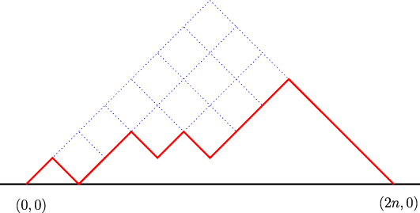

Catalan Isomorphisms
====================

Experiments with type-safe encoding and translation of various mathematical objects which are counted by the Catalan numbers, such as Dyck paths, ordered trees, binary trees, and others.

The central type defined in this module is that of a [Dyck path](http://mathworld.wolfram.com/DyckPath.html) — a lattice path which does not cross below the diagonal and terminates at the same height at which it began (illustrated below courtesy of the [Journal of Statistical Mechanics](http://iopscience.iop.org/1742-5468/2009/03/P03025/fulltext/)).



The datatype to represent this structure is called an `NNPath`, short for non-negative path. Non-negative paths are indexed by a type parameter indicating the height of their end; therefore, Dyck paths — and thus the type `Dyck` — are simply synonymous with non-negative paths of terminating height zero; in other words, `type Dyck = NNPath Z`.

With the Catalan package, you can construct the above-illustrated Dyck path in two different ways.

Using simply the type constructors (`U` for up, `D` for down, and `End` for an empty path):

```Haskell
D (D (D (D (U (U (U (D (U (D (U (U (D (U End)))))))))))))
```

I also introduce the `(-)` operator. It allows one to construct paths more succinctly, and in an order matching the diagram. In reality, `(-) = flip ($)`, but with a type restricting its application to contructors of non-negative paths:

```Haskell
(-) :: NNPath x -> (NNPath x -> NNPath y) -> NNPath y
```

With it, the same path is described as:

```Haskell
End-U-D-U-U-D-U-D-U-U-U-D-D-D-D
```

If you don't like that the module exports an operator which occludes the normal subtraction operator, suggestions for a different name are welcome. :)

Non-negative paths are implemented in this module as a GADT which prevents the construction of paths violating the non-negativity constraint. As such, the following is a compile-time type error:

```Haskell
End-U-D-D
```

...or equivalently:

```Haskell
(D (D (U End)))
```

We can concatenate two non-negative paths to yield another non-negative path using the following operation:

```Haskell
(|+|) :: NNPath n -> NNPath m -> NNPath (Plus m n)
```

For instance:

```Haskell
End-U-U-D-D |+| End-U-D == End-U-U-D-D-U-D
```

The parameter order of the `|+|` function is such that it makes visual sense when used with the `End-U-D` construction syntax; it feels backwards when used with the `D (U End)` constructor application syntax. This is the case for many of the operations in this module, and as such, the former is the preferred syntax for constructing non-negative paths. (Note that when destructuring a non-negative path, you are still doing this from "right" to "left".)


